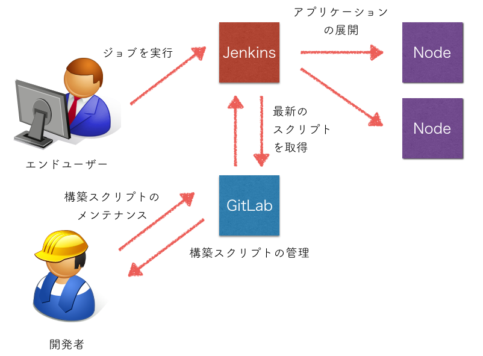
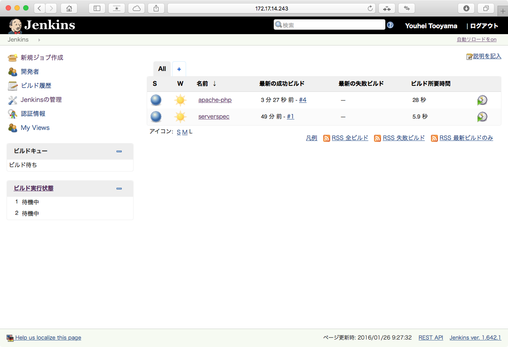
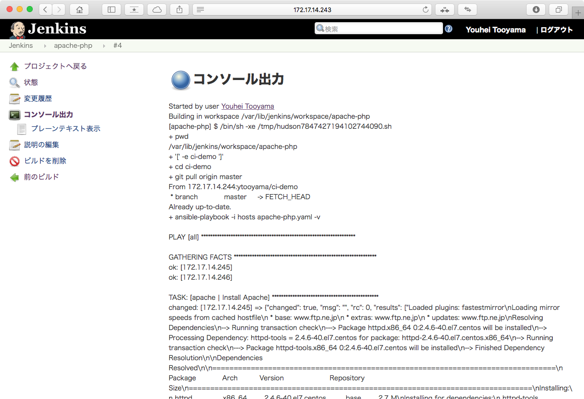

Title: CIデモ環境 構築手順書
Company: 日本仮想化技術

# CIデモ環境 構築手順書

<div class="title">
バージョン：1.3<br>
2016年02月03日<br>
<br>
日本仮想化技術株式会社
</div>

<!-- BREAK -->

## 変更履歴

|バージョン|更新日|更新内容|
|:---|:---|:---|
|1.0|2015/11/11|初版|
|1.1|2015/11/18|デモ環境の構築手順（4章）の追加|
|1.2|2016/02/03|パブリックに公開|
|1.3|2016/02/03|挿絵を追加|

<!-- BREAK -->

## 目次

<!--TOC max3-->

<!-- BREAK -->

本書ではJenkins、Ansible、Serverspec、GitLabを利用したCI(Continuous Integration)デモ環境を構築する手順を解説しています。

本書の手順に従ってセットアップすることで、アプリケーションのデプロイやシステムの状態の確認、管理を行うためのJenkins、Jenkinsから指示を受けてアプリケーションデプロイメントを実際に処理するAnsible、そしてAnsibleが実行する処理を記述したスクリプトであるAnsible Playbookを管理するGitlab環境を構築することができます。



<!-- BREAK -->


## 1. 構成情報

### 1.1 システムの構成 

本環境は以下に述べるサーバーで構成しています。

#### Jenkinsサーバー(jenkins)

本環境ではJenkinsを使用して定型ジョブを管理します。
また、パッケージのインストールなど各ノードへのコマンドの実行はAnsible、サーバーの自動テストにはServerspecを利用します。

IPアドレスは192.168.1.10/24を利用します。

#### GitLabサーバー(gitlab)

Jenkinsのジョブで使用するシェルスクリプトやAnsible Playbookのバージョン管理を行います。

Ansible PlaybookとはAnsibleを使ってデプロイしたい構成を記述するものです。ルールに則って記述すれば、パッケージのインストール、アプリケーションの設定、システムの更新などを自動化できます。また、同じOSとバージョン上で実行するのであればAnsible Playbookを使ってデプロイメントすることで全く同じ環境を何度も構築することができます。

IPアドレスは192.168.1.20/24を利用します。

#### デプロイターゲット(target-1/target-2)

Jenkinsによりアプリケーションのデプロイメントを実行する対象のサーバーです。本書では2台のサーバーを用意します。OSはCentOS 7をインストールし、IPアドレスの設定なども事前に行っておきます。

IPアドレスは192.168.1.101/24と192.168.1.102/24を利用します。

<!-- BREAK -->

#### 作業用マシン(desktop)

Gitlab作業用にLinux/UNIXコマンドが実行できる環境を推奨します。本例ではCentOS 7にGNOMEをインストールしたマシンを用意します。ブラウザー作業もこのクライアント上で行います。gitコマンドを利用するので、事前に`yum install git`でコマンドをインストールしておいてください。

IPアドレスは192.168.1.0/24の範囲のネットワークに接続し、任意のIPアドレスを設定します。


### 1.2 バージョン構成

本書では以下のソフトウェアバージョンを用いて環境構築できることを確認しています。

コンポーネント | バージョン
--------|-------------
CentOS | release 7.2.1511
Jenkins | 1.642
Ansible | 1.9.4-1
GitLab | 8.1.2
Serverspec | 2.29.1

<!-- BREAK -->

## 2. Jenkinsサーバーのセットアップ

### 2.1 OSの最新化

あらかじめCentOS 7をインストールしたサーバーを用意し、yumコマンドでOSの最新化を実行します。

```
jenkins# yum update 
```

### 2.2 Javaのインストール

JenkinsはJavaを使用しているため、yumコマンドを使ってopenjdkパッケージをインストールします。

```
jenkins# yum install java-1.7.0-openjdk
```

### 2.3 Jenkinsのインストール

jenkins-ci.orgで公開しているリポジトリを追加し、Jenkinsをインストールします。

```
jenkins# curl http://pkg.jenkins-ci.org/redhat-stable/jenkins.repo -o /etc/yum.repos.d/jenkins.repo
jenkins# rpm --import https://jenkins-ci.org/redhat/jenkins-ci.org.key
jenkins# yum install jenkins
```

### 2.4 gitクライアントのインストールと初期設定

yumコマンドでgitクライアントをインストールします。

```
jenkins# yum install git
```

<!-- BREAK -->

### 2.5 ファイアーウォールの設定

Jenkinsサーバーが使用するポートを開放します。

```
jenkins# firewall-cmd --add-port=8080/tcp --zone=public --permanent
jenkins# firewall-cmd --reload
```

TCP/8080ポートが開き、ファイアーウォールが正しく設定されていることを確認します。

```
jenkins# firewall-cmd --zone=public --list-ports

8080/tcp
```

### 2.6 Jenkinsの起動

Jenkinsサービスの起動と自動起動の有効化を設定します。

```
jenkins# systemctl start jenkins
jenkins# chkconfig jenkins on
```

ブラウザでJenkinsのトップページへアクセスできることを確認します。

```
http://[IPアドレス]:8080/
```

### 2.7 Ansibleのインストール

EPELリポジトリーを追加し、JenkinsサーバーへAnsibleをインストールします。

```
jenkins# yum install epel-release && yum update
jenkins# yum install ansible
```

<!-- BREAK -->

### 2.8 Serverspecのインストール

ServerspecはRubyGemsで公開されているため、まずyumコマンドでRubyGemsパッケージをインストールします。

```
jenkins# yum install rubygems rubygem-rake
```

gemコマンドでserverspecパッケージをインストールします。

```
jenkins# gem install serverspec
```

gemはRuby用のパッケージ管理システムです。正式にはRubygemsと言うものです。一般的なパッケージ管理システムと同様、インストール(gem install)、アップデート(gem update)、検索(gem search)、アンインストール(gem uninstall)などといった処理をサポートしています。

### 2.9 Jenkins の初期設定

#### セキュリティ設定

Jenkinsのデフォルト設定ではジョブの作成や実行がだれでも行えるようになっているため、ユーザーを作成してセキュリティ設定を変更します。

#### ユーザーの作成

Jenkins内で使用するユーザーアカウントを作成します。

- ブラウザでJenkinsのトップページへアクセス
- メニューより [Jenkinsの管理] - [グローバルセキュリティの設定] をクリック
- [セキュリティの有効化] にチェック
- [アクセス制御] の [ユーザー情報] で [Jenkinsのユーザーデータベース] を選択
- [権限管理] で [ログイン済みユーザーに許可] を選択
- 「保存」をクリック
- ユーザー名とパスワードの画面に遷移するので、「アカウントを登録」をクリックしてユーザーを作成

<!-- BREAK -->

## 3. GitLabサーバーのセットアップ

### 3.1 OSの最新化

あらかじめCentOS 7をインストールしたサーバーを用意し、yumコマンドでOSの最新化を実行します。

```
gitlab# yum update 
```

### 3.2 必要なパッケージのインストールと設定

Gitlabのインストールを始めるにあたり事前に必要なパッケージのインストールと初期設定を行います。
まず、必要なパッケージがインストール済みかどうか確認します。

```
gitlab# yum list installed | egrep "curl|openssh-server|postfix"
```

インストール済みの場合はSSHサーバーとPostfixサーバーがサービスが起動していることを確認してください。インストールされていない場合は以下のようにコマンドを実行して、パッケージのインストールとファイアウォールの設定を行います。

```
gitlab# yum install curl openssh-server
gitlab# systemctl enable sshd
gitlab# systemctl start sshd

gitlab# yum install postfix
gitlab# systemctl enable postfix
gitlab# systemctl start postfix

gitlab# firewall-cmd --permanent --add-service=http
gitlab# systemctl reload firewalld
```

### 3.3 GitLabパッケージのインストール

GitLab.comで公開しているリポジトリーを登録しGitLabをインストールします。

```
gitlab# curl https://packages.gitlab.com/install/repositories/gitlab/gitlab-ce/script.rpm.sh | bash
gitlab# yum install gitlab-ce
```

<!-- BREAK -->

### 3.4 GitLabの初期設定

通知メールのドメインをデフォルトから切り替えます。ここではIPアドレスを指定します。
その他設定を変更した項目があれば設定を書き換えます。

```
gitlab# vi /etc/gitlab/gitlab.rb
...
external_url 'http://192.168.1.20'
```

書き換えが終わったら、Gitlabの初期設定コマンドを実行します。

```
gitlab# gitlab-ctl reconfigure
```

コマンド実行後に、ブラウザでGitLabへアクセスできることを確認します。

URL: `http://192.168.1.20/`

アカウント:

```
Username: root
password: 5iveL!fe  ← 仮パスワード
```

### 3.5 root パスワードの設定

ログイン後、画面に従いrootアカウントのパスワードを設定します。Current passwordに前の手順で入力した仮パスワードを入力し、新しいパスワードを2回入力して「Set new password」をクリックします。

パスワード設定後に一旦ログイン画面へ戻るので、設定したパスワードを入力してログインします。

<!-- BREAK -->

### 3.6 ユーザーの作成

以下の手順でGitlabの一般ユーザーを作成します。

- 構築したGitHabへブラウザでアクセスし、rootアカウントでログイン
- ページ右上の [Admin area] アイコンをクリック
- 「Users」の項目のなかから [NEW USER] ボタンをクリック
- 本名、ユーザー名、メールアドレス等必要な情報を入力し [CREATE USER] ボタンをクリック
- メールが届くのでURLを確認してリンクをクリック
- ユーザーのパスワードを2回入力して設定
- ログインできることを確認する

<!-- BREAK -->

## 4. デモ環境の構築

### 4.1 ソースファイルの初期設定

ソースファイルを展開し、IPアドレス等の環境依存となる部分を変更します。


#### ソースファイルの展開

ソースファイルを任意のディレクトリへ展開します。

```
desktop$ unzip ci-demo-src.zip
desktop$ unzip spec-demo-master.zip
desktop$ mkdir bin && mv *.zip bin/
```

#### デプロイ先ノードの設定

以下のファイルを編集してデプロイ先のIPアドレスまたはホスト名を入力します。

##### Jenkins 対象ノードの設定

```
desktop$ vi ci-demo-master/hosts
192.168.1.101  ← デプロイターゲット1
192.168.1.102  ← デプロイターゲット2
```

<!-- BREAK -->

##### Serverspec 対象ノードの設定

```
desktop$ vi spec-demo-master/properties.yaml
192.168.1.101:  ← デプロイターゲット1
  :roles:
    - base
    - apache
    - php
    - web_contents
192.168.1.102:  ← デプロイターゲット2
  :roles:
    - base
    - apache
    - php
    - web_contents
```

※デプロイターゲットはJenkinsによりサーバーを構築するターゲットサーバーを指定します。ターゲットサーバーにセットアップする処理を定義します。


#### デモ用Webコンテンツの変更

各ノードへ配信するデモ用Webコンテンツを変更する場合は以下のファイルを差し替えます。

- ci-demo-master/roles/copy\_web\_contents/files/index.html

配信するファイルを増やしたい場合は以下のファイルを編集します。

- ci-demo-master/roles/copy\_web\_contents/tasks/main.yaml
- spec-demo-master/spec/web\_contents/contents\_spec.rb

<!-- BREAK -->


### 4.2 GitHabへのファイルのアップロード(Push)

構築したGitLab上にプロジェクトを作成しソースファイルをアップロードします。アップロード元として利用するクライアントはGitクライアントが使用できる環境であればどの端末からでも可能ですが、GitLabへSSH認証鍵を登録する必要があります。

#### SSH認証鍵の作成と登録

GitLabへ登録するSSH認証鍵をJenkinsユーザーで作成します。パスワードなしでログインできるようにするため、パスワード入力が求められたらEnterを押して続行します。

```
jenkins# sudo -u jenkins ssh-keygen
Generating public/private rsa key pair.
Enter file in which to save the key (/var/lib/jenkins/.ssh/id_rsa):
Enter passphrase (empty for no passphrase):
Enter same passphrase again:
Your identification has been saved in /var/lib/jenkins/.ssh/id_rsa.
Your public key has been saved in /var/lib/jenkins/.ssh/id_rsa.pub.
The key fingerprint is:
0a:17:a2:b8:a0:02:8d:a2:2c:90:ea:82:09:bc:8f:35 jenkins@Jenkins
The key's randomart image is:
+--[ RSA 2048]----+
|                 |
|           +     |
|          o =    |
|       . o = .   |
|        S + o    |
|       . . o +  .|
|            O.o.o|
|           o.E.oo|
|          ...  ..|
+-----------------+
```

作成した公開鍵を確認します。

```
jenkins# cat /var/lib/jenkins/.ssh/id_rsa.pub
```

作業用マシンからGitlabにソースのアップロードをできるようにするため、作業用マシンでもパスワードなしのSSH認証鍵を作成します。

```
desktop$ ssh-keygen
desktop$ cat ~/.ssh/id_rsa.pub
```

<!-- BREAK -->

#### SSH公開鍵の登録

先ほど作成した公開鍵を任意のユーザーでログインしてGitLabへ登録します。

- GitLabへブラウザでアクセスし、任意のアカウントでログイン
- 左サードバーメニューの [Profile Setting] をクリック
- 左サードバーメニューより [SSH Keys] をクリック
- [ADD SSH KEY] ボタンをクリック
- Key欄へ先ほど作成した公開鍵を貼り付け、[ADD KEY]をクリック

GitLabへSSH公開鍵登録後、クライアント側へGitLabサーバーのフィンガープリントを登録するため、一度SSHコマンドで接続します。

```
jenkins# sudo -u jenkins ssh git@192.168.1.20
...
Are you sure you want to continue connecting (yes/no)? yes 
                       "yes" を回答しフィンガープリントを登録 ↑
Warning: Permanently added '192.168.1.20' (ECDSA) to the list of known hosts.
PTY allocation request failed on channel 0
Welcome to GitLab, vtj-taguchi! ← GitLabのユーザー名が表示されることを確認
Connection to 192.168.1.20 closed.
```

※192.168.1.20はGitLabサーバーのIPアドレスを指定します。


#### プロジェクトの作成

本環境では、GitLab上で2つのプロジェクトを作成しソースを管理します。各プロジェクトの詳細は以下のとおりです。

プロジェクト名 | 用途
------------ | --------
ci-demo | Ansible Playbook のソースを管理
spec-demo | 自動テスト(Serverspec)のソースを管理

<!-- BREAK -->

##### 作成手順

- 構築したGitHabへブラウザでアクセスし、任意のアカウントでログイン
- ページ左上の [Dashboard]アイコンをクリック
- [NEW PROJECT]ボタンをクリック
- Project pathにプロジェクト名を入力後、Visibility Levelは[Public]を選択し [CREATE PROJECT] をクリック

#### GitLabへソースファイルをアップロード

ci-demo-masterとspec-demo-masterへファイルをアップロード(Push)します。ユーザー名、パスワードは先の手順でSSH鍵を登録した任意のユーザーを設定します。

```
desktop$ git config --global user.name "[ユーザー名]"
desktop$ git config --global user.email "[メールアドレス]"

desktop$ cd ci-demo-master
desktop$ git init
desktop$ git remote add origin git@192.168.1.20:[GitLabユーザー名]/ci-demo.git
desktop$ git add .
desktop$ git commit -m '1st commit.'
desktop$ git push -u origin master

desktop$ cd ../spec-demo-master
desktop$ git init
desktop$ git remote add origin git@192.168.1.20:[GitLabユーザー名]/spec-demo.git
desktop$ git add .
desktop$ git commit -m '1st commit.'
desktop$ git push -u origin master
```

※192.168.1.20はGitLabサーバーのIPアドレスを指定します。

<!-- BREAK -->

### 4.3 Jenkinsジョブの作成

デモ用のジョブを作成します。作成するジョブは以下のとおりです。

ジョブ名 | 使用コンポーネント | 内容
-------- | -------- | ----
apache-php | Ansible | yumコマンドでApacheとPHPのパッケージをインストールし初期設定を行います。
serverspec | Serverspec | ノードのデプロイが正しく完了したか確認します。


- ブラウザでJenkinsのトップページへアクセスしログイン
- 左のメニューより「新規ジョブ作成」をクリック
- ジョブ名欄にジョブ名を入力、作成項目は「フリースタイル・プロジェクトのビルド」を選択し、OKボタンをクリック
- 「設定」の画面ではビルド項目内の [ビルド手順の追加] - [シェルの実行] をクリック
- 表示されるテキストボックスに下記に記述しているスクリプトを記入し [保存] ボタンをクリック

<!-- BREAK -->

#### apache-php ジョブ用スクリプト

```
if [ -e ci-demo ]; then
  cd ci-demo
  git pull origin master
else
  git clone git@192.168.1.20:[GitLabユーザー名]/ci-demo.git
  cd ci-demo
fi

ansible-playbook -i hosts apache-php.yaml -v
```

※192.168.1.20はGitLabサーバーのIPアドレスを指定します。

#### spec-demo ジョブ用スクリプト

```
if [ -e spec-demo ]; then
  cd spec-demo
  git pull origin master
else
  git clone git@192.168.1.20:[GitLabユーザー名]/spec-demo.git
  cd spec-demo
fi

rake
```

※192.168.1.20はGitLabサーバーのIPアドレスを指定します。

<!-- BREAK -->

### 4.4 デプロイターゲットへの公開鍵登録

JenkinsサーバーへインストールしたAnsibleがデプロイターゲットへリモート接続してコマンドを実行するため、デプロイターゲットそれぞれのSSH公開鍵をJenkinsサーバーに登録します。

```
jenkins# sudo -u jenkins ssh-copy-id root@[デプロイ先のIPアドレス]
...
Are you sure you want to continue connecting (yes/no)? yes
                       "yes" を回答しフィンガープリントを登録 ↑
/bin/ssh-copy-id: INFO: attempting to log in with the new key(s), to filter out any that are already installed
/bin/ssh-copy-id: INFO: 1 key(s) remain to be installed -- if you are prompted now it is to install the new keys
root@xxx.xxx.xxx.xxx's password:  ← デプロイ先ノードのrootパスワードを入力

Number of key(s) added: 1

Now try logging into the machine, with:   "ssh 'root@xxx.xxx.xxx.xxx'"
and check to make sure that only the key(s) you wanted were added.
```

<!-- BREAK -->

## 5. ジョブの実行

作成したJenkinsのジョブはWeb UIから実行します。手順は以下のとおりです。

- ブラウザでJenkinsのトップページへアクセスしてログイン
- ログイン後表示される右側のジョブ一覧より起動したいジョブをクリック
- 左側のメニューより「ビルド実行」をクリック

ジョブを実行すると左下の「ビルド履歴」欄に新しいタスクが表示されます。タスクをクリックして「コンソール出力」をクリックするとジョブを実行したときのコンソールログを確認することができます。



<!-- BREAK -->

